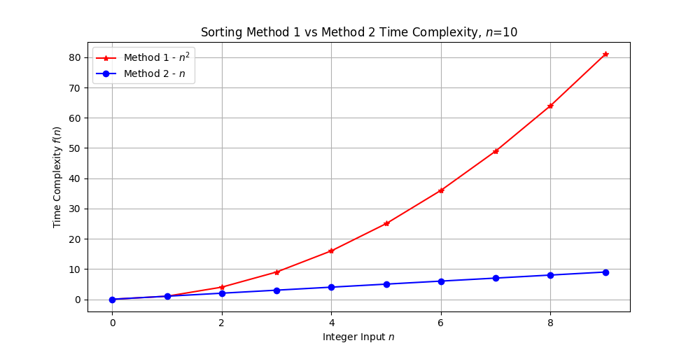
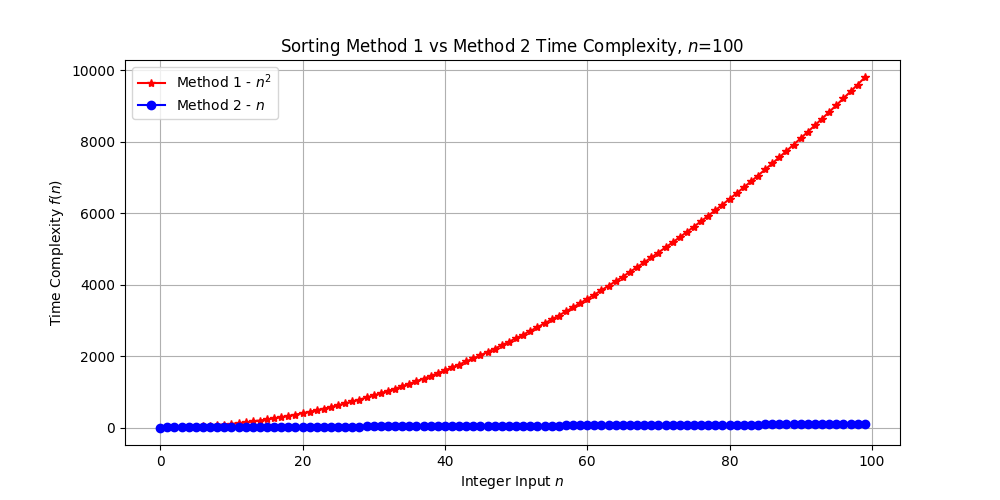
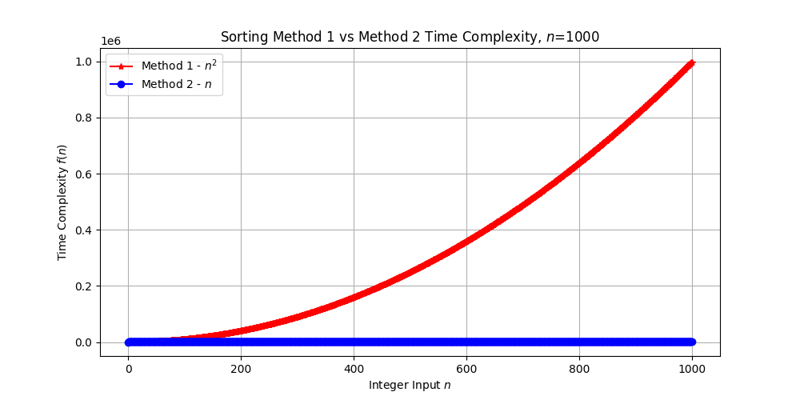
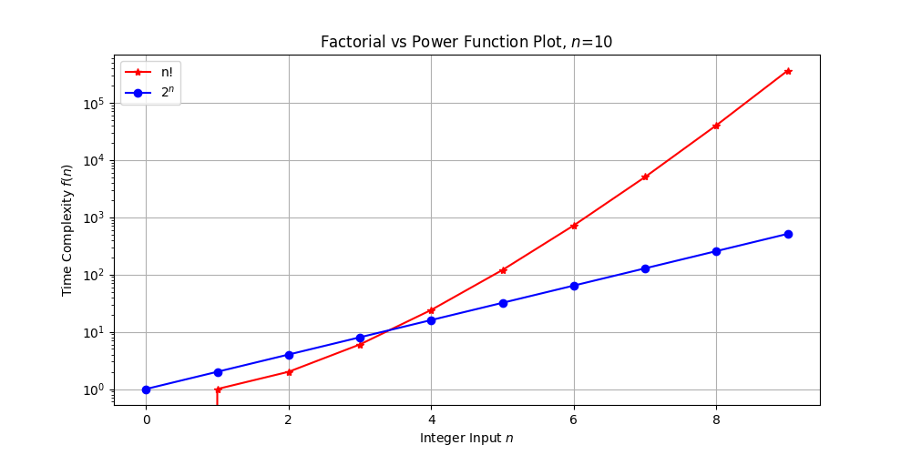
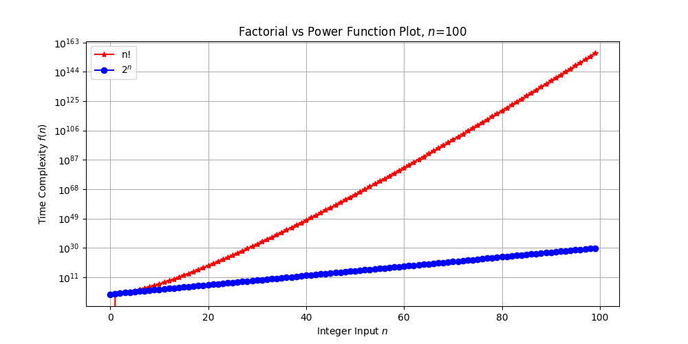

# CS361L-homework-1

### Method 1 & 2 Analysis

Using matplotlib in Python3, I plotted the time complexity for the sorting methods 1 & 2 that we used in class. The results for different values of *n* can be seen below.

These plots make it clear that Method 1 has a much worse time complexity, as $n^{2}$ increases exponentially while $n$ increases linearly, and at a long time (as *n* gets bigger), Method 2 looks constant compared to Method 1.

### Factorial and Exponential Analysis

Similarly to the first part, I plotted $n!$ and $2^{n}$  with matplotlib to view the relationship between them. Note that here I used log scaling to be able to see the relation better.

Although for very small values of *n*, $n!$ takes less time than $2^{n}$, it is clear that $n!$ grows faster than $2^{n}$ as *n* gets larger and larger. In fact, I did not plot these for *n*=1000 because I got an integer overflow error when running the code, even as low as *n*=200 since $n!$ was too big (which could be fixed but *n* going up to 100 shows the relationship clearly).